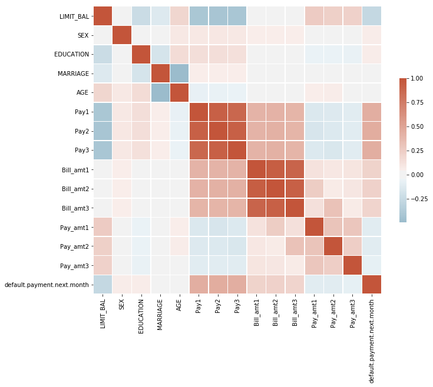
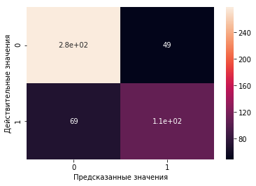

```python
import pandas as pd
import seaborn as sns
import numpy as np
import matplotlib.pyplot as plt
```

### Описание датасета
Этот набор данных содержит информацию о платежах по умолчанию, демографических факторах, кредитных данных, истории платежей и выписках по счетам клиентов по кредитным картам на Тайване с июля 2005 года по сентябрь 2005 года. Качественные признаки были уже преобразованы в количественные.


```python
df = pd.read_csv('defaultcredit.csv')
df.head()
```


<div>
<style scoped>
    .dataframe tbody tr th:only-of-type {
        vertical-align: middle;
    }

    .dataframe tbody tr th {
        vertical-align: top;
    }

    .dataframe thead th {
        text-align: right;
    }
</style>
<table border="1" class="dataframe">
  <thead>
    <tr style="text-align: right;">
      <th></th>
      <th>ID</th>
      <th>LIMIT_BAL</th>
      <th>SEX</th>
      <th>EDUCATION</th>
      <th>MARRIAGE</th>
      <th>AGE</th>
      <th>Pay1</th>
      <th>Pay2</th>
      <th>Pay3</th>
      <th>Bill_amt1</th>
      <th>Bill_amt2</th>
      <th>Bill_amt3</th>
      <th>Pay_amt1</th>
      <th>Pay_amt2</th>
      <th>Pay_amt3</th>
      <th>default.payment.next.month</th>
    </tr>
  </thead>
  <tbody>
    <tr>
      <th>0</th>
      <td>12</td>
      <td>260000.0</td>
      <td>Female</td>
      <td>1</td>
      <td>Single</td>
      <td>51</td>
      <td>-1</td>
      <td>-1</td>
      <td>2</td>
      <td>8517.0</td>
      <td>22287.0</td>
      <td>13668.0</td>
      <td>22301.0</td>
      <td>0.0</td>
      <td>3640.0</td>
      <td>0</td>
    </tr>
    <tr>
      <th>1</th>
      <td>13</td>
      <td>630000.0</td>
      <td>Female</td>
      <td>2</td>
      <td>Single</td>
      <td>41</td>
      <td>-1</td>
      <td>-1</td>
      <td>-1</td>
      <td>6500.0</td>
      <td>6500.0</td>
      <td>2870.0</td>
      <td>6500.0</td>
      <td>2870.0</td>
      <td>0.0</td>
      <td>0</td>
    </tr>
    <tr>
      <th>2</th>
      <td>17</td>
      <td>20000.0</td>
      <td>Male</td>
      <td>1</td>
      <td>Single</td>
      <td>24</td>
      <td>2</td>
      <td>2</td>
      <td>2</td>
      <td>18338.0</td>
      <td>17905.0</td>
      <td>19104.0</td>
      <td>0.0</td>
      <td>1650.0</td>
      <td>0.0</td>
      <td>1</td>
    </tr>
    <tr>
      <th>3</th>
      <td>18</td>
      <td>320000.0</td>
      <td>Male</td>
      <td>1</td>
      <td>Married</td>
      <td>49</td>
      <td>-1</td>
      <td>-1</td>
      <td>-1</td>
      <td>70074.0</td>
      <td>5856.0</td>
      <td>195599.0</td>
      <td>20000.0</td>
      <td>195599.0</td>
      <td>50000.0</td>
      <td>0</td>
    </tr>
    <tr>
      <th>4</th>
      <td>22</td>
      <td>120000.0</td>
      <td>Female</td>
      <td>2</td>
      <td>Married</td>
      <td>39</td>
      <td>-1</td>
      <td>-1</td>
      <td>-1</td>
      <td>0.0</td>
      <td>632.0</td>
      <td>316.0</td>
      <td>632.0</td>
      <td>316.0</td>
      <td>0.0</td>
      <td>1</td>
    </tr>
  </tbody>
</table>
</div>


Вывод первых 5-и полей для понимания структуры данных


```python
df.shape
```


    (5338, 16)


Датасет имеет 16 столбцов и 25312 наблюдения 


```python
df.dtypes
```


    ID                              int64
    LIMIT_BAL                     float64
    SEX                            object
    EDUCATION                       int64
    MARRIAGE                       object
    AGE                             int64
    Pay1                            int64
    Pay2                            int64
    Pay3                            int64
    Bill_amt1                     float64
    Bill_amt2                     float64
    Bill_amt3                     float64
    Pay_amt1                      float64
    Pay_amt2                      float64
    Pay_amt3                      float64
    default.payment.next.month      int64
    dtype: object


Тип данных в каждом из столбцов, мы видим только количественные признаки


```python
df.columns
```


    Index(['ID', 'LIMIT_BAL', 'SEX', 'EDUCATION', 'MARRIAGE', 'AGE', 'Pay1',
           'Pay2', 'Pay3', 'Bill_amt1', 'Bill_amt2', 'Bill_amt3', 'Pay_amt1',
           'Pay_amt2', 'Pay_amt3', 'default.payment.next.month'],
          dtype='object')


### Физическое описание датасета   

#### Экзогенные переменные:    
ID : ID каждого клиента   
LIMIT_BAL : сумма предоставленного кредита в тайваньских долларах (включает индивидуальный и семейный / дополнительный кредит   
SEX : Male/Female   
EDUCATION : (1 = аспирантура, 2 = университет, 3 = средняя школа, 4 = другие, 5 = неизвестно, 6 = неизвестно)   
MARRIAGE : Married, Single, Other  
AGE : Возраст в годах   
Pay3 : Статус погашения в сентябре 2005 г. (-1 = надлежащая оплата, 1 = задержка платежа на один месяц, 2 = задержка платежа на два месяца,… 8 = задержка платежа на восемь месяцев, 9 = задержка платежа на девять месяцев и более)   
Pay2 : Статус погашения в августе 2005 г. (шкала такая же, как указано выше)   
Pay1 : Статус погашения в июле 2005 г. (шкала такая же, как указано выше)   
Bill_amt3 : Сумма выписки по счету за сентябрь 2005 г. (NT-доллар)   
Bill_amt2 : Сумма выписки по счету в августе 2005 г. (NT-доллар)   
Bill_amt1 : Сумма выписки по счету в июле 2005 г. (NT-доллар)    
Pay_amt3 : Сумма предыдущего платежа в сентябре 2005 г. (NT-доллар)   
Pay_amt2 : Сумма предыдущего платежа в августе 2005 г. (NT-доллар)   
Pay_amt1 : Сумма предыдущего платежа в июле 2005 г. (NT-доллар)  
#### Эндогенная переменная:    
default.payment.next.month : платеж по умолчанию (1 = да, 0 = нет)

Удалим ненужные для модели данные (ID)


```python
df.drop(columns=["ID"], inplace=True)
```

Проверим на наличие пропусков в данных


```python
df.isna().sum()
```


    LIMIT_BAL                     0
    SEX                           0
    EDUCATION                     0
    MARRIAGE                      0
    AGE                           0
    Pay1                          0
    Pay2                          0
    Pay3                          0
    Bill_amt1                     0
    Bill_amt2                     0
    Bill_amt3                     0
    Pay_amt1                      0
    Pay_amt2                      0
    Pay_amt3                      0
    default.payment.next.month    0
    dtype: int64


Выведем количество уникальных значений для каждого столбца


```python
df.nunique()
```


    LIMIT_BAL                       64
    SEX                              2
    EDUCATION                        7
    MARRIAGE                         4
    AGE                             52
    Pay1                             9
    Pay2                             8
    Pay3                             8
    Bill_amt1                     3993
    Bill_amt2                     3976
    Bill_amt3                     3973
    Pay_amt1                      2410
    Pay_amt2                      2353
    Pay_amt3                      2219
    default.payment.next.month       2
    dtype: int64


```python
df.EDUCATION.unique()
```


    array([1, 2, 3, 6, 4, 0, 5], dtype=int64)


```python
df.shape
```


    (5338, 15)


```python
df.drop(df[df.EDUCATION == 0].index, inplace = True)
df.shape
```


    (5334, 15)


```python
df.EDUCATION.unique()
```


    array([1, 2, 3, 6, 4, 5], dtype=int64)


```python
df.MARRIAGE.unique()
```


    array(['Single', 'Married', 'Other', '0'], dtype=object)


```python
df.drop(df[df.MARRIAGE == "0"].index, inplace = True)
```


```python
df.MARRIAGE.unique()
```


    array(['Single', 'Married', 'Other'], dtype=object)


```python
df.shape
```


    (5320, 15)


### Преобразуем качественные данные в количественные
Используем метод LabelEncoder


```python
from sklearn import preprocessing
le = preprocessing.LabelEncoder()
le.fit(df.SEX)
df.SEX = le.transform(df.SEX)
df.head()
```


<div>
<style scoped>
    .dataframe tbody tr th:only-of-type {
        vertical-align: middle;
    }

    .dataframe tbody tr th {
        vertical-align: top;
    }

    .dataframe thead th {
        text-align: right;
    }
</style>
<table border="1" class="dataframe">
  <thead>
    <tr style="text-align: right;">
      <th></th>
      <th>LIMIT_BAL</th>
      <th>SEX</th>
      <th>EDUCATION</th>
      <th>MARRIAGE</th>
      <th>AGE</th>
      <th>Pay1</th>
      <th>Pay2</th>
      <th>Pay3</th>
      <th>Bill_amt1</th>
      <th>Bill_amt2</th>
      <th>Bill_amt3</th>
      <th>Pay_amt1</th>
      <th>Pay_amt2</th>
      <th>Pay_amt3</th>
      <th>default.payment.next.month</th>
    </tr>
  </thead>
  <tbody>
    <tr>
      <th>0</th>
      <td>260000.0</td>
      <td>0</td>
      <td>1</td>
      <td>Single</td>
      <td>51</td>
      <td>-1</td>
      <td>-1</td>
      <td>2</td>
      <td>8517.0</td>
      <td>22287.0</td>
      <td>13668.0</td>
      <td>22301.0</td>
      <td>0.0</td>
      <td>3640.0</td>
      <td>0</td>
    </tr>
    <tr>
      <th>1</th>
      <td>630000.0</td>
      <td>0</td>
      <td>2</td>
      <td>Single</td>
      <td>41</td>
      <td>-1</td>
      <td>-1</td>
      <td>-1</td>
      <td>6500.0</td>
      <td>6500.0</td>
      <td>2870.0</td>
      <td>6500.0</td>
      <td>2870.0</td>
      <td>0.0</td>
      <td>0</td>
    </tr>
    <tr>
      <th>2</th>
      <td>20000.0</td>
      <td>1</td>
      <td>1</td>
      <td>Single</td>
      <td>24</td>
      <td>2</td>
      <td>2</td>
      <td>2</td>
      <td>18338.0</td>
      <td>17905.0</td>
      <td>19104.0</td>
      <td>0.0</td>
      <td>1650.0</td>
      <td>0.0</td>
      <td>1</td>
    </tr>
    <tr>
      <th>3</th>
      <td>320000.0</td>
      <td>1</td>
      <td>1</td>
      <td>Married</td>
      <td>49</td>
      <td>-1</td>
      <td>-1</td>
      <td>-1</td>
      <td>70074.0</td>
      <td>5856.0</td>
      <td>195599.0</td>
      <td>20000.0</td>
      <td>195599.0</td>
      <td>50000.0</td>
      <td>0</td>
    </tr>
    <tr>
      <th>4</th>
      <td>120000.0</td>
      <td>0</td>
      <td>2</td>
      <td>Married</td>
      <td>39</td>
      <td>-1</td>
      <td>-1</td>
      <td>-1</td>
      <td>0.0</td>
      <td>632.0</td>
      <td>316.0</td>
      <td>632.0</td>
      <td>316.0</td>
      <td>0.0</td>
      <td>1</td>
    </tr>
  </tbody>
</table>
</div>


Теперь 0 - девушка, 1 - мужчина


```python
le2 = preprocessing.LabelEncoder()
le2.fit(df.MARRIAGE)
print(le2.transform(df.MARRIAGE))
df.MARRIAGE = le2.transform(df.MARRIAGE)
df.head()
```

    [2 2 2 ... 2 0 2]
    


<div>
<style scoped>
    .dataframe tbody tr th:only-of-type {
        vertical-align: middle;
    }

    .dataframe tbody tr th {
        vertical-align: top;
    }

    .dataframe thead th {
        text-align: right;
    }
</style>
<table border="1" class="dataframe">
  <thead>
    <tr style="text-align: right;">
      <th></th>
      <th>LIMIT_BAL</th>
      <th>SEX</th>
      <th>EDUCATION</th>
      <th>MARRIAGE</th>
      <th>AGE</th>
      <th>Pay1</th>
      <th>Pay2</th>
      <th>Pay3</th>
      <th>Bill_amt1</th>
      <th>Bill_amt2</th>
      <th>Bill_amt3</th>
      <th>Pay_amt1</th>
      <th>Pay_amt2</th>
      <th>Pay_amt3</th>
      <th>default.payment.next.month</th>
    </tr>
  </thead>
  <tbody>
    <tr>
      <th>0</th>
      <td>260000.0</td>
      <td>0</td>
      <td>1</td>
      <td>2</td>
      <td>51</td>
      <td>-1</td>
      <td>-1</td>
      <td>2</td>
      <td>8517.0</td>
      <td>22287.0</td>
      <td>13668.0</td>
      <td>22301.0</td>
      <td>0.0</td>
      <td>3640.0</td>
      <td>0</td>
    </tr>
    <tr>
      <th>1</th>
      <td>630000.0</td>
      <td>0</td>
      <td>2</td>
      <td>2</td>
      <td>41</td>
      <td>-1</td>
      <td>-1</td>
      <td>-1</td>
      <td>6500.0</td>
      <td>6500.0</td>
      <td>2870.0</td>
      <td>6500.0</td>
      <td>2870.0</td>
      <td>0.0</td>
      <td>0</td>
    </tr>
    <tr>
      <th>2</th>
      <td>20000.0</td>
      <td>1</td>
      <td>1</td>
      <td>2</td>
      <td>24</td>
      <td>2</td>
      <td>2</td>
      <td>2</td>
      <td>18338.0</td>
      <td>17905.0</td>
      <td>19104.0</td>
      <td>0.0</td>
      <td>1650.0</td>
      <td>0.0</td>
      <td>1</td>
    </tr>
    <tr>
      <th>3</th>
      <td>320000.0</td>
      <td>1</td>
      <td>1</td>
      <td>0</td>
      <td>49</td>
      <td>-1</td>
      <td>-1</td>
      <td>-1</td>
      <td>70074.0</td>
      <td>5856.0</td>
      <td>195599.0</td>
      <td>20000.0</td>
      <td>195599.0</td>
      <td>50000.0</td>
      <td>0</td>
    </tr>
    <tr>
      <th>4</th>
      <td>120000.0</td>
      <td>0</td>
      <td>2</td>
      <td>0</td>
      <td>39</td>
      <td>-1</td>
      <td>-1</td>
      <td>-1</td>
      <td>0.0</td>
      <td>632.0</td>
      <td>316.0</td>
      <td>632.0</td>
      <td>316.0</td>
      <td>0.0</td>
      <td>1</td>
    </tr>
  </tbody>
</table>
</div>


Теперь 0 - женат/замужем, 2 - одинок, 1 - другое

### Количественные характеристики данных


```python
df.describe()
```


<div>
<style scoped>
    .dataframe tbody tr th:only-of-type {
        vertical-align: middle;
    }

    .dataframe tbody tr th {
        vertical-align: top;
    }

    .dataframe thead th {
        text-align: right;
    }
</style>
<table border="1" class="dataframe">
  <thead>
    <tr style="text-align: right;">
      <th></th>
      <th>LIMIT_BAL</th>
      <th>SEX</th>
      <th>EDUCATION</th>
      <th>MARRIAGE</th>
      <th>AGE</th>
      <th>Pay1</th>
      <th>Pay2</th>
      <th>Pay3</th>
      <th>Bill_amt1</th>
      <th>Bill_amt2</th>
      <th>Bill_amt3</th>
      <th>Pay_amt1</th>
      <th>Pay_amt2</th>
      <th>Pay_amt3</th>
      <th>default.payment.next.month</th>
    </tr>
  </thead>
  <tbody>
    <tr>
      <th>count</th>
      <td>5320.000000</td>
      <td>5320.000000</td>
      <td>5320.000000</td>
      <td>5320.000000</td>
      <td>5320.000000</td>
      <td>5320.000000</td>
      <td>5320.000000</td>
      <td>5320.000000</td>
      <td>5320.000000</td>
      <td>5320.000000</td>
      <td>5320.000000</td>
      <td>5320.000000</td>
      <td>5320.000000</td>
      <td>5320.000000</td>
      <td>5320.000000</td>
    </tr>
    <tr>
      <th>mean</th>
      <td>169996.240602</td>
      <td>0.397744</td>
      <td>1.768985</td>
      <td>0.980451</td>
      <td>36.244173</td>
      <td>0.239286</td>
      <td>0.209398</td>
      <td>0.221429</td>
      <td>22099.053759</td>
      <td>22023.530827</td>
      <td>22517.390602</td>
      <td>4792.756203</td>
      <td>5120.728759</td>
      <td>4768.647180</td>
      <td>0.326504</td>
    </tr>
    <tr>
      <th>std</th>
      <td>126243.690674</td>
      <td>0.489478</td>
      <td>0.756383</td>
      <td>0.995380</td>
      <td>9.169928</td>
      <td>1.735379</td>
      <td>1.721475</td>
      <td>1.694642</td>
      <td>43197.351426</td>
      <td>42484.812261</td>
      <td>43833.864567</td>
      <td>12087.677791</td>
      <td>15775.508516</td>
      <td>15666.402091</td>
      <td>0.468978</td>
    </tr>
    <tr>
      <th>min</th>
      <td>10000.000000</td>
      <td>0.000000</td>
      <td>1.000000</td>
      <td>0.000000</td>
      <td>21.000000</td>
      <td>-1.000000</td>
      <td>-1.000000</td>
      <td>-1.000000</td>
      <td>-3903.000000</td>
      <td>-15306.000000</td>
      <td>-339603.000000</td>
      <td>0.000000</td>
      <td>0.000000</td>
      <td>0.000000</td>
      <td>0.000000</td>
    </tr>
    <tr>
      <th>25%</th>
      <td>60000.000000</td>
      <td>0.000000</td>
      <td>1.000000</td>
      <td>0.000000</td>
      <td>29.000000</td>
      <td>-1.000000</td>
      <td>-1.000000</td>
      <td>-1.000000</td>
      <td>889.750000</td>
      <td>884.250000</td>
      <td>801.500000</td>
      <td>328.500000</td>
      <td>2.000000</td>
      <td>0.000000</td>
      <td>0.000000</td>
    </tr>
    <tr>
      <th>50%</th>
      <td>150000.000000</td>
      <td>0.000000</td>
      <td>2.000000</td>
      <td>0.000000</td>
      <td>35.000000</td>
      <td>-1.000000</td>
      <td>-1.000000</td>
      <td>-1.000000</td>
      <td>4467.500000</td>
      <td>4272.000000</td>
      <td>4477.000000</td>
      <td>1500.000000</td>
      <td>1257.000000</td>
      <td>1040.000000</td>
      <td>0.000000</td>
    </tr>
    <tr>
      <th>75%</th>
      <td>240000.000000</td>
      <td>1.000000</td>
      <td>2.000000</td>
      <td>2.000000</td>
      <td>42.000000</td>
      <td>2.000000</td>
      <td>2.000000</td>
      <td>2.000000</td>
      <td>22916.250000</td>
      <td>23520.250000</td>
      <td>24527.250000</td>
      <td>4296.250000</td>
      <td>4167.500000</td>
      <td>3686.750000</td>
      <td>1.000000</td>
    </tr>
    <tr>
      <th>max</th>
      <td>800000.000000</td>
      <td>1.000000</td>
      <td>6.000000</td>
      <td>2.000000</td>
      <td>75.000000</td>
      <td>8.000000</td>
      <td>8.000000</td>
      <td>8.000000</td>
      <td>486776.000000</td>
      <td>503914.000000</td>
      <td>527711.000000</td>
      <td>250144.000000</td>
      <td>303512.000000</td>
      <td>345293.000000</td>
      <td>1.000000</td>
    </tr>
  </tbody>
</table>
</div>


### Корреляция, матрица корреляций


```python
df.corr()
```


<div>
<style scoped>
    .dataframe tbody tr th:only-of-type {
        vertical-align: middle;
    }

    .dataframe tbody tr th {
        vertical-align: top;
    }

    .dataframe thead th {
        text-align: right;
    }
</style>
<table border="1" class="dataframe">
  <thead>
    <tr style="text-align: right;">
      <th></th>
      <th>LIMIT_BAL</th>
      <th>SEX</th>
      <th>EDUCATION</th>
      <th>MARRIAGE</th>
      <th>AGE</th>
      <th>Pay1</th>
      <th>Pay2</th>
      <th>Pay3</th>
      <th>Bill_amt1</th>
      <th>Bill_amt2</th>
      <th>Bill_amt3</th>
      <th>Pay_amt1</th>
      <th>Pay_amt2</th>
      <th>Pay_amt3</th>
      <th>default.payment.next.month</th>
    </tr>
  </thead>
  <tbody>
    <tr>
      <th>LIMIT_BAL</th>
      <td>1.000000</td>
      <td>0.010642</td>
      <td>-0.236333</td>
      <td>-0.131825</td>
      <td>0.198323</td>
      <td>-0.411370</td>
      <td>-0.424183</td>
      <td>-0.413851</td>
      <td>0.036890</td>
      <td>0.021979</td>
      <td>0.034711</td>
      <td>0.259770</td>
      <td>0.233104</td>
      <td>0.222920</td>
      <td>-0.261860</td>
    </tr>
    <tr>
      <th>SEX</th>
      <td>0.010642</td>
      <td>1.000000</td>
      <td>-0.023954</td>
      <td>0.010174</td>
      <td>0.087388</td>
      <td>0.087353</td>
      <td>0.093021</td>
      <td>0.086005</td>
      <td>0.052517</td>
      <td>0.050762</td>
      <td>0.052258</td>
      <td>-0.005103</td>
      <td>0.003320</td>
      <td>-0.000257</td>
      <td>0.059065</td>
    </tr>
    <tr>
      <th>EDUCATION</th>
      <td>-0.236333</td>
      <td>-0.023954</td>
      <td>1.000000</td>
      <td>-0.168062</td>
      <td>0.162827</td>
      <td>0.145533</td>
      <td>0.147181</td>
      <td>0.132466</td>
      <td>0.010812</td>
      <td>0.013294</td>
      <td>0.006881</td>
      <td>-0.060313</td>
      <td>-0.056446</td>
      <td>-0.063816</td>
      <td>0.064805</td>
    </tr>
    <tr>
      <th>MARRIAGE</th>
      <td>-0.131825</td>
      <td>0.010174</td>
      <td>-0.168062</td>
      <td>1.000000</td>
      <td>-0.494477</td>
      <td>0.050271</td>
      <td>0.053409</td>
      <td>0.051942</td>
      <td>-0.007208</td>
      <td>-0.009308</td>
      <td>-0.005046</td>
      <td>-0.028312</td>
      <td>-0.002652</td>
      <td>0.006984</td>
      <td>-0.003642</td>
    </tr>
    <tr>
      <th>AGE</th>
      <td>0.198323</td>
      <td>0.087388</td>
      <td>0.162827</td>
      <td>-0.494477</td>
      <td>1.000000</td>
      <td>-0.069136</td>
      <td>-0.064611</td>
      <td>-0.058987</td>
      <td>0.009286</td>
      <td>0.006619</td>
      <td>0.012289</td>
      <td>0.053369</td>
      <td>0.062028</td>
      <td>0.022568</td>
      <td>0.008738</td>
    </tr>
    <tr>
      <th>Pay1</th>
      <td>-0.411370</td>
      <td>0.087353</td>
      <td>0.145533</td>
      <td>0.050271</td>
      <td>-0.069136</td>
      <td>1.000000</td>
      <td>0.920226</td>
      <td>0.885168</td>
      <td>0.405284</td>
      <td>0.420700</td>
      <td>0.401172</td>
      <td>-0.141373</td>
      <td>-0.130543</td>
      <td>-0.111617</td>
      <td>0.444308</td>
    </tr>
    <tr>
      <th>Pay2</th>
      <td>-0.424183</td>
      <td>0.093021</td>
      <td>0.147181</td>
      <td>0.053409</td>
      <td>-0.064611</td>
      <td>0.920226</td>
      <td>1.000000</td>
      <td>0.923781</td>
      <td>0.411986</td>
      <td>0.422611</td>
      <td>0.402254</td>
      <td>-0.165855</td>
      <td>-0.136958</td>
      <td>-0.114623</td>
      <td>0.450904</td>
    </tr>
    <tr>
      <th>Pay3</th>
      <td>-0.413851</td>
      <td>0.086005</td>
      <td>0.132466</td>
      <td>0.051942</td>
      <td>-0.058987</td>
      <td>0.885168</td>
      <td>0.923781</td>
      <td>1.000000</td>
      <td>0.407067</td>
      <td>0.426123</td>
      <td>0.400439</td>
      <td>-0.136221</td>
      <td>-0.155288</td>
      <td>-0.112512</td>
      <td>0.443165</td>
    </tr>
    <tr>
      <th>Bill_amt1</th>
      <td>0.036890</td>
      <td>0.052517</td>
      <td>0.010812</td>
      <td>-0.007208</td>
      <td>0.009286</td>
      <td>0.405284</td>
      <td>0.411986</td>
      <td>0.407067</td>
      <td>1.000000</td>
      <td>0.937731</td>
      <td>0.904676</td>
      <td>0.118624</td>
      <td>0.094135</td>
      <td>0.108484</td>
      <td>0.213260</td>
    </tr>
    <tr>
      <th>Bill_amt2</th>
      <td>0.021979</td>
      <td>0.050762</td>
      <td>0.013294</td>
      <td>-0.009308</td>
      <td>0.006619</td>
      <td>0.420700</td>
      <td>0.422611</td>
      <td>0.426123</td>
      <td>0.937731</td>
      <td>1.000000</td>
      <td>0.928205</td>
      <td>0.255617</td>
      <td>0.069803</td>
      <td>0.096757</td>
      <td>0.225632</td>
    </tr>
    <tr>
      <th>Bill_amt3</th>
      <td>0.034711</td>
      <td>0.052258</td>
      <td>0.006881</td>
      <td>-0.005046</td>
      <td>0.012289</td>
      <td>0.401172</td>
      <td>0.402254</td>
      <td>0.400439</td>
      <td>0.904676</td>
      <td>0.928205</td>
      <td>1.000000</td>
      <td>0.134445</td>
      <td>0.319997</td>
      <td>0.069769</td>
      <td>0.209749</td>
    </tr>
    <tr>
      <th>Pay_amt1</th>
      <td>0.259770</td>
      <td>-0.005103</td>
      <td>-0.060313</td>
      <td>-0.028312</td>
      <td>0.053369</td>
      <td>-0.141373</td>
      <td>-0.165855</td>
      <td>-0.136221</td>
      <td>0.118624</td>
      <td>0.255617</td>
      <td>0.134445</td>
      <td>1.000000</td>
      <td>0.310597</td>
      <td>0.295173</td>
      <td>-0.113446</td>
    </tr>
    <tr>
      <th>Pay_amt2</th>
      <td>0.233104</td>
      <td>0.003320</td>
      <td>-0.056446</td>
      <td>-0.002652</td>
      <td>0.062028</td>
      <td>-0.130543</td>
      <td>-0.136958</td>
      <td>-0.155288</td>
      <td>0.094135</td>
      <td>0.069803</td>
      <td>0.319997</td>
      <td>0.310597</td>
      <td>1.000000</td>
      <td>0.250470</td>
      <td>-0.109601</td>
    </tr>
    <tr>
      <th>Pay_amt3</th>
      <td>0.222920</td>
      <td>-0.000257</td>
      <td>-0.063816</td>
      <td>0.006984</td>
      <td>0.022568</td>
      <td>-0.111617</td>
      <td>-0.114623</td>
      <td>-0.112512</td>
      <td>0.108484</td>
      <td>0.096757</td>
      <td>0.069769</td>
      <td>0.295173</td>
      <td>0.250470</td>
      <td>1.000000</td>
      <td>-0.074950</td>
    </tr>
    <tr>
      <th>default.payment.next.month</th>
      <td>-0.261860</td>
      <td>0.059065</td>
      <td>0.064805</td>
      <td>-0.003642</td>
      <td>0.008738</td>
      <td>0.444308</td>
      <td>0.450904</td>
      <td>0.443165</td>
      <td>0.213260</td>
      <td>0.225632</td>
      <td>0.209749</td>
      <td>-0.113446</td>
      <td>-0.109601</td>
      <td>-0.074950</td>
      <td>1.000000</td>
    </tr>
  </tbody>
</table>
</div>


```python
f, ax = plt.subplots(figsize=(11, 9))

cmap = sns.diverging_palette(230, 20, as_cmap=True)
sns.heatmap(df.corr(), cmap=cmap, vmax=1, center=0, square=True, linewidths=.5, cbar_kws={"shrink": .5})
```


    <matplotlib.axes._subplots.AxesSubplot at 0x246d6a056a0>


    

    


```python
for i in df.corr().columns:
    for j in range(len(df.corr().columns)):
        if abs(abs(df.corr().iloc[j][i])) > 0.9 and df.corr().iloc[j][i] != 1:
            print(df.corr().iloc[j][i], "- корреляция", df.corr().columns[j], i, "- сильно зависимые данные")
```

    0.920226169152885 - корреляция Pay2 Pay1 - сильно зависимые данные
    0.920226169152885 - корреляция Pay1 Pay2 - сильно зависимые данные
    0.9237805040971502 - корреляция Pay3 Pay2 - сильно зависимые данные
    0.9237805040971502 - корреляция Pay2 Pay3 - сильно зависимые данные
    0.9377309710392575 - корреляция Bill_amt2 Bill_amt1 - сильно зависимые данные
    0.9046764920204556 - корреляция Bill_amt3 Bill_amt1 - сильно зависимые данные
    0.9377309710392575 - корреляция Bill_amt1 Bill_amt2 - сильно зависимые данные
    0.9282050130861003 - корреляция Bill_amt3 Bill_amt2 - сильно зависимые данные
    0.9046764920204556 - корреляция Bill_amt1 Bill_amt3 - сильно зависимые данные
    0.9282050130861003 - корреляция Bill_amt2 Bill_amt3 - сильно зависимые данные
    

Исходя из этих данных мы можем принять решение об удалении одного поля (Bill_amt2, Bill_amt3, Pay2) и оставить только один признак Bill_amt1, поскольку данные сильно кореллируют между собой и для отсутствия ошибки переобучения модели их нужно убрать из нашего датасета.


```python
df.drop(columns=["Bill_amt2", "Bill_amt3", "Pay2"], inplace=True)
df.shape
```


    (5320, 12)


```python
df.corr()["default.payment.next.month"]
```


    LIMIT_BAL                    -0.261860
    SEX                           0.059065
    EDUCATION                     0.064805
    MARRIAGE                     -0.003642
    AGE                           0.008738
    Pay1                          0.444308
    Pay3                          0.443165
    Bill_amt1                     0.213260
    Pay_amt1                     -0.113446
    Pay_amt2                     -0.109601
    Pay_amt3                     -0.074950
    default.payment.next.month    1.000000
    Name: default.payment.next.month, dtype: float64


### Построение распределений признаков, выявление аномалий и их устранение


```python
plt.figure(figsize=(12, 3))
# Вывод графиков
plt.subplot(1, 2, 1)
sns.distplot(df.LIMIT_BAL, kde=True,bins=200, color="blue")
plt.subplot(1, 2, 2)
df.SEX.hist()
```


    <matplotlib.axes._subplots.AxesSubplot at 0x246d6a16eb8>


    

    


На графике признака LIMIT_BAL мы видим, что основной размер кредита в выборке не выходит за 600 000 тайваньский долларов. Значения после отметки в 600 000 являются нечастыми выбросами.    

Удалим аномальные наблюдения из нашей выборки


```python
df.drop(df[df.LIMIT_BAL > 600000].index, inplace=True)
df.shape
```


    (5313, 12)


```python
plt.figure(figsize=(12, 3))
plt.subplot(1, 2, 1)
df.EDUCATION.hist()
plt.subplot(1, 2, 2)
df.MARRIAGE.hist()
```


    <matplotlib.axes._subplots.AxesSubplot at 0x246d6f5b7f0>


    

    


Поскольку 5-6 принимает смысл «неизвестно», такое могло случиться при ошибке ввода данных, поэтому стоит удалить эти значения. 1 в столбце брачный статус означает другое, что странно, тоже удаляем.


```python
df.drop(df[df.EDUCATION > 4].index, inplace = True)
df.drop(df[df.MARRIAGE == 1].index, inplace = True)
df.shape
```


    (5241, 12)


```python
plt.figure(figsize=(12, 3))
plt.subplot(1, 2, 1)
sns.distplot(df.AGE, kde=True,bins=200, color="blue")
plt.subplot(1, 2, 2)
df.Pay1.hist()
```


    <matplotlib.axes._subplots.AxesSubplot at 0x246d3849e48>


    

    


На графике распределения признака AGE мы наблюдаем основное значение в пределах 70 лет.   
На графиках Pay1-3 сильных отклонений нет, значения реальны


```python
plt.figure(figsize=(12, 3))
df.Pay3.hist()
```


    <matplotlib.axes._subplots.AxesSubplot at 0x246d70d8e10>


    

    


```python
plt.figure(figsize=(15, 5))
sns.distplot(df.Bill_amt1, kde=True,bins=200, color="blue")
```


    <matplotlib.axes._subplots.AxesSubplot at 0x246d73487f0>


    
    


Видно, что основная часть значений находится в диапозоне до 250 000, остальные значения являются нечастыми появлениями.


```python
df.drop(df[df.Bill_amt1 > 250000].index, inplace=True)
df.shape
```


    (5211, 12)


```python
plt.figure(figsize=(15, 5))
sns.distplot(df.Pay_amt1, kde=True,bins=200, color="blue")
```


    <matplotlib.axes._subplots.AxesSubplot at 0x246d7407eb8>


    

    


Основая часть приходится на значения до 50 000


```python
df.drop(df[df.Pay_amt1 > 50000].index, inplace=True)
df.shape
```


    (5141, 12)


```python
plt.figure(figsize=(15, 5))
sns.distplot(df.Pay_amt2, kde=True,bins=200, color="blue")
```


    <matplotlib.axes._subplots.AxesSubplot at 0x246d75ed828>


    

    


Основная часть до 50000.


```python
df.drop(df[df.Pay_amt2 > 50000].index, inplace=True)
df.shape
```


    (5086, 12)


```python
plt.figure(figsize=(15, 5))
sns.distplot(df.Pay_amt3, kde=True,bins=200, color="blue")
```


    <matplotlib.axes._subplots.AxesSubplot at 0x246d791be10>


    

    


Основная масса значений сосредоточнеа до 50000


```python
df.drop(df[df.Pay_amt3 > 50000].index, inplace=True)
df.shape
```


    (5035, 12)


### Расбалансировка целевой переменной


```python
temp = df['default.payment.next.month'].value_counts()
sns.barplot(data=df, x=temp.index, y=temp.values)
```


    <matplotlib.axes._subplots.AxesSubplot at 0x246d7ca29b0>


    

    


### Нормализация данных    
Поскольку признаки имеют очень заметный дисбаланс в значениях, для улучшения модели мы должны нормализовать данные.


```python
X = df.drop(columns=['default.payment.next.month'])
Y = df['default.payment.next.month']
```

Разделим выборку на экзогенные и эндогенные переменные


```python
X.describe().loc['mean']
```


    LIMIT_BAL    164154.915591
    SEX               0.398610
    EDUCATION         1.759484
    MARRIAGE          0.980338
    AGE              36.119364
    Pay1              0.261172
    Pay3              0.248262
    Bill_amt1     20116.188083
    Pay_amt1       3555.347964
    Pay_amt2       3480.403575
    Pay_amt3       3045.262363
    Name: mean, dtype: float64


По значению "mean" таблицы сверху можно понять, что некоторые признаки имеют сильный дисбаланс значений. Это может привести к ухудшению модели и осложенинию ее обучения. Для этого нам стоит нормализовать наши признаки. Для нормализации я буду использовать метод минимакс, которое происходит по формуле:   
# <center> $ \frac{X - X_{min}}{X_{max} - X_{min}} $ <center/>


```python
for i in X:
    X[i] = (X[i] - X[i].min()) / (X[i].max() - X[i].min())
```


```python
X.describe().loc["mean"]
```


    LIMIT_BAL    0.261280
    SEX          0.398610
    EDUCATION    0.253161
    MARRIAGE     0.490169
    AGE          0.279988
    Pay1         0.140130
    Pay3         0.138696
    Bill_amt1    0.096495
    Pay_amt1     0.071107
    Pay_amt2     0.069608
    Pay_amt3     0.060905
    Name: mean, dtype: float64


Наши признаки нормализованы.


```python
X.head()
```


<div>
<style scoped>
    .dataframe tbody tr th:only-of-type {
        vertical-align: middle;
    }

    .dataframe tbody tr th {
        vertical-align: top;
    }

    .dataframe thead th {
        text-align: right;
    }
</style>
<table border="1" class="dataframe">
  <thead>
    <tr style="text-align: right;">
      <th></th>
      <th>LIMIT_BAL</th>
      <th>SEX</th>
      <th>EDUCATION</th>
      <th>MARRIAGE</th>
      <th>AGE</th>
      <th>Pay1</th>
      <th>Pay3</th>
      <th>Bill_amt1</th>
      <th>Pay_amt1</th>
      <th>Pay_amt2</th>
      <th>Pay_amt3</th>
    </tr>
  </thead>
  <tbody>
    <tr>
      <th>0</th>
      <td>0.423729</td>
      <td>0.0</td>
      <td>0.000000</td>
      <td>1.0</td>
      <td>0.555556</td>
      <td>0.000000</td>
      <td>0.333333</td>
      <td>0.049896</td>
      <td>0.44602</td>
      <td>0.00000</td>
      <td>0.0728</td>
    </tr>
    <tr>
      <th>2</th>
      <td>0.016949</td>
      <td>1.0</td>
      <td>0.000000</td>
      <td>1.0</td>
      <td>0.055556</td>
      <td>0.333333</td>
      <td>0.333333</td>
      <td>0.089351</td>
      <td>0.00000</td>
      <td>0.03300</td>
      <td>0.0000</td>
    </tr>
    <tr>
      <th>4</th>
      <td>0.186441</td>
      <td>0.0</td>
      <td>0.333333</td>
      <td>0.0</td>
      <td>0.333333</td>
      <td>0.000000</td>
      <td>0.000000</td>
      <td>0.015680</td>
      <td>0.01264</td>
      <td>0.00632</td>
      <td>0.0000</td>
    </tr>
    <tr>
      <th>5</th>
      <td>0.101695</td>
      <td>0.0</td>
      <td>0.333333</td>
      <td>1.0</td>
      <td>0.092593</td>
      <td>0.333333</td>
      <td>0.333333</td>
      <td>0.192470</td>
      <td>0.07202</td>
      <td>0.00000</td>
      <td>0.0364</td>
    </tr>
    <tr>
      <th>6</th>
      <td>0.084746</td>
      <td>1.0</td>
      <td>0.000000</td>
      <td>1.0</td>
      <td>0.111111</td>
      <td>0.000000</td>
      <td>0.000000</td>
      <td>0.015451</td>
      <td>0.01000</td>
      <td>0.00000</td>
      <td>0.0200</td>
    </tr>
  </tbody>
</table>
</div>


### Разбиение выборки на обучающую и тестовую


```python
from sklearn.model_selection import train_test_split
```


```python
x_train, x_test, y_train, y_test = train_test_split(X, Y, test_size=0.1, random_state=True)
```

### Обучение модели, метрики качества
#### Модель метрического классификитора на основе логистической регрессии.

Построим модель логистической регрессии


```python
from sklearn.linear_model import LogisticRegression
cls = LogisticRegression()
```

Обучим классификатор


```python
cls.fit(x_train, y_train)
```


    LogisticRegression()


Предскажем значения на тестовой выборке


```python
y_pred = cls.predict(x_test)
```

Оценим эффективность модели


```python
from sklearn import metrics
metrics.confusion_matrix(y_test, y_pred)
```


    array([[278,  49],
           [ 69, 108]], dtype=int64)


```python
%matplotlib inline
class_names = [0, 1]
fig, ax = plt.subplots()
ticks = np.arange(len(class_names))
plt.xticks(ticks, class_names)
plt.yticks(ticks, class_names)
sns.heatmap(pd.DataFrame(
metrics.confusion_matrix(y_test, y_pred)), annot=True)
plt.ylabel('Действительные значения')
plt.xlabel('Предсказанные значения')
```


    Text(0.5,15,'Предсказанные значения')


    

    


```python
metrics.accuracy_score(y_test, y_pred)
```


    0.7658730158730159


```python
metrics.precision_score(y_test, y_pred)
```


    0.6878980891719745


```python
metrics.recall_score(y_test, y_pred)
```


    0.6101694915254238


```python
metrics.f1_score(y_test, y_pred)
```


    0.6467065868263473


```python
from sklearn.metrics import classification_report
print(metrics.confusion_matrix(y_test, y_pred))
print(classification_report(y_test, y_pred))
```

    [[278  49]
     [ 69 108]]
                  precision    recall  f1-score   support
    
               0       0.80      0.85      0.82       327
               1       0.69      0.61      0.65       177
    
        accuracy                           0.77       504
       macro avg       0.74      0.73      0.74       504
    weighted avg       0.76      0.77      0.76       504
    
    

Метрики показали плохой результат, только метрика accuracy выше 0.7, но она не является лучшей метрикой для оценки модели. По важным метриками recall и ф-мера модель показала неудовлетворительный результат.


```python
metrics.roc_auc_score(y_test, y_pred)
```


    0.7301611983621002


#### Построение классификатора методом k-ближайших соседей

Для начала используем K со значением 5


```python
from sklearn.neighbors import KNeighborsClassifier
classifier = KNeighborsClassifier(n_neighbors=5)
classifier.fit(x_train, y_train)
```


    KNeighborsClassifier()


```python
y_pred = classifier.predict(x_test)
```


```python
metrics.confusion_matrix(y_test, y_pred)
```


    array([[267,  60],
           [ 89,  88]], dtype=int64)


```python
%matplotlib inline
class_names = [0, 1]
fig, ax = plt.subplots()
ticks = np.arange(len(class_names))
plt.xticks(ticks, class_names)
plt.yticks(ticks, class_names)
sns.heatmap(pd.DataFrame(
metrics.confusion_matrix(y_test, y_pred)), annot=True)
plt.ylabel('Действительные значения')
plt.xlabel('Предсказанные значения')
```


    Text(0.5,15,'Предсказанные значения')


    

    


```python
from sklearn.metrics import classification_report
print(metrics.confusion_matrix(y_test, y_pred))
print(classification_report(y_test, y_pred))
```

    [[267  60]
     [ 89  88]]
                  precision    recall  f1-score   support
    
               0       0.75      0.82      0.78       327
               1       0.59      0.50      0.54       177
    
        accuracy                           0.70       504
       macro avg       0.67      0.66      0.66       504
    weighted avg       0.70      0.70      0.70       504
    
    


```python
metrics.accuracy_score(y_test, y_pred)
```


    0.7043650793650794


```python
metrics.roc_auc_score(y_test, y_pred)
```


    0.6568444513554139


#### Классификатор методом опорных векторов


```python
from sklearn.svm import SVC
svclassifier = SVC(kernel='linear')
svclassifier.fit(x_train, y_train)
```


    SVC(kernel='linear')


```python
y_pred = svclassifier.predict(x_test)
```


```python
print(metrics.confusion_matrix(y_test, y_pred))
print(classification_report(y_test, y_pred))
```

    [[266  61]
     [ 54 123]]
                  precision    recall  f1-score   support
    
               0       0.83      0.81      0.82       327
               1       0.67      0.69      0.68       177
    
        accuracy                           0.77       504
       macro avg       0.75      0.75      0.75       504
    weighted avg       0.77      0.77      0.77       504
    
    


```python
metrics.roc_auc_score(y_test, y_pred)
```


    0.7541854558648213


```python
%matplotlib inline
class_names = [0, 1]
fig, ax = plt.subplots()
ticks = np.arange(len(class_names))
plt.xticks(ticks, class_names)
plt.yticks(ticks, class_names)
sns.heatmap(pd.DataFrame(
metrics.confusion_matrix(y_test, y_pred)), annot=True)
plt.ylabel('Действительные значения')
plt.xlabel('Предсказанные значения')
```


    Text(0.5,15,'Предсказанные значения')


    

    


```python
metrics.accuracy_score(y_test, y_pred)
```


    0.7718253968253969


### Заключение
Лучшей моделью является классификатор на основе опорных векторов.    
Метричные показатели не велики, поскольку данные сильно зависят от человечкского фактора. Более точно предсказать нельзя.
